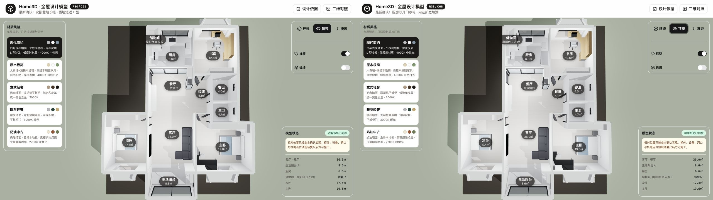
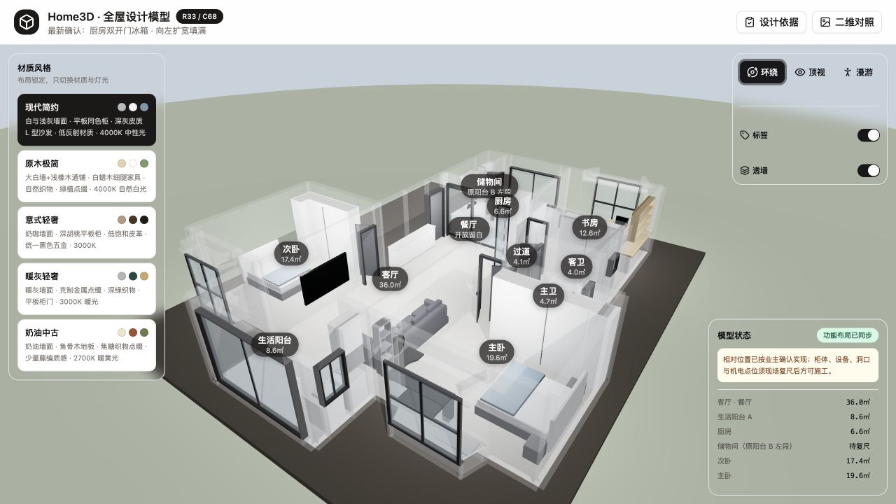
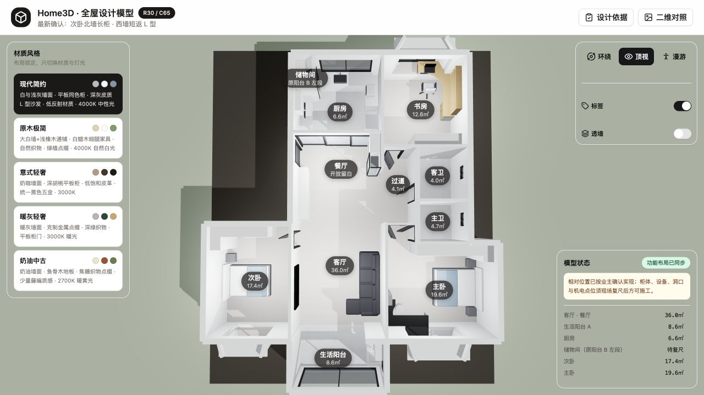
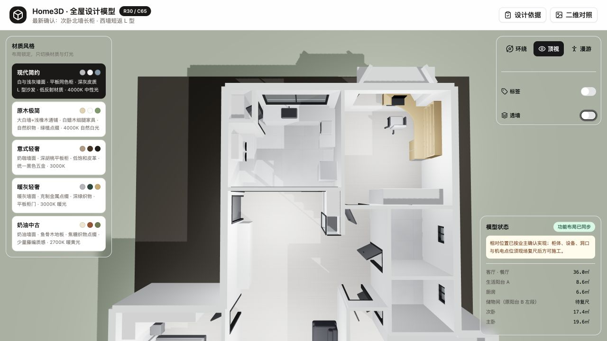
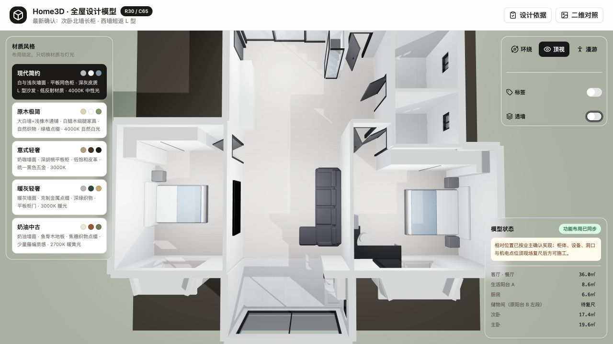
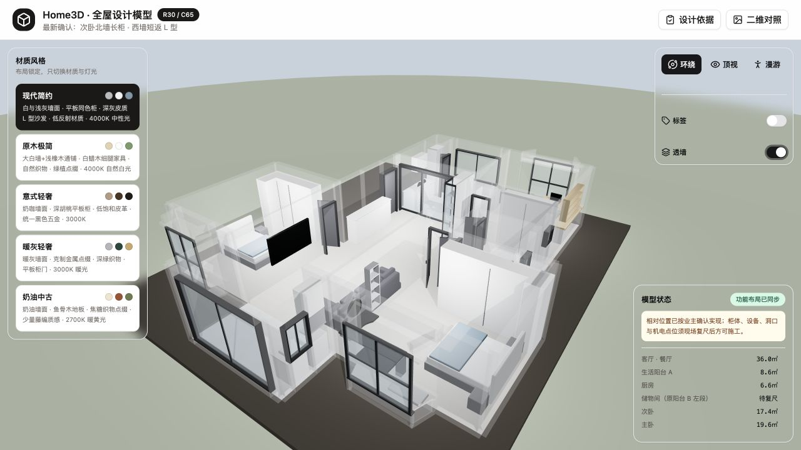

# Angelica's Home R30 全屋空间设计审计

审计日期：2026-07-19  
审计版本：R30 / C65  
审计顺序：入户 → 厨房 → 储物间 → 客厅 → 主卧 → 次卧 → 书房 → 主卫/客卫

## 结论先行

当前方案的优点是：公共区主轴清晰、柜体语言统一、客厅与书房主动做了减法、主卧与书房的一体桌面有明确功能逻辑。当前仍不应进入定制下单或施工图阶段，最重要的原因有五个：

1. 储物间约 `0.95 × 1.15 m` 的模型空间内放入约 `0.52 m` 深高柜，余下通行约 `0.43 m`，按当前表达基本无法正常进入、转身和取物。
2. 主卫与客卫没有马桶、台盆、淋浴、地漏、浴室柜和干湿分区，属于“空间边界已建、卫浴设计未开始”。
3. 卫生间及厨房的面积标签与模型几何包络存在明显差异，所有尺寸判断仍只能视为方案参考，必须先统一面积与完成面口径。
4. 客厅壁挂电视模型中心高约 `1.50 m`，对常规沙发坐姿偏高；L 型沙发阳台侧端部参考余量仅约 `0.58 m`。
5. 主卧衣柜短返与上侧床头柜模型间隙约 `0.02 m`；次卧 L 柜短返与床头柜约 `0.26 m`，两处都容易形成开门、清洁或施工收口问题。

整体建议：先完成“尺寸与门扇冲突修正”，再做“柜体内部与机电深化”，最后做材质、灯光和软装。不要在当前阶段继续增加柜量或装饰造型。

## R33 细节优化落实记录

落实日期：2026-07-19  
模型版本：`R33 / C68`  
调整边界：保留房间分区、厨房 U 形关系、独立储物间、客厅 L 型沙发与无茶几、主次卧床位和 L 柜方向、书房 U 弧 L 桌及主卧梳妆区，仅优化可由现模型安全判断的尺寸、净距与收口。

| 空间 | R33 已落实 | 结果 |
|---|---|---|
| 玄关 | 半高柜参考深度 `0.48 → 0.38 m`、落物面 `1.15 → 0.98 m`，底部增加约 `0.18 m` 常穿鞋位；正对柜顶部改为约 `20 mm` 可控阴影缝 | 保留长柜与高低对比，入口更轻、落物更顺手 |
| 储物间 | 标准深柜 `0.52 → 0.28 m`，下部约 `0.72 m` 做推进式留空 | 参考站立宽度 `0.43 → 0.67 m`，独立储物间理念不变 |
| 客厅 | 电视中心参考高 `1.50 → 1.20 m` | 沙发、贵妃、电视横向轴线和无茶几理念不变 |
| 主卧 | L 柜短返终点 `8.95 → 8.72 m`；梳妆腿部净高 `0.58 → 0.62 m`；飘窗软包完成坐高约 `0.48 m` | 消除床头柜旁约 `20 mm` 死缝，保留双床头柜和 U 弧梳妆区 |
| 次卧 | L 柜短返终点 `8.45 → 8.26 m`；床头后安装缝约 `0.025 m` | 柜到床头柜净距约 `0.45 m`，床、门和 L 柜方向不变 |
| 书房 | 三层书架底板 `1.08 → 1.35 m`、净层高 `0.28 → 0.32 m` | 显示器与 A4 书籍适配更好，一体 L 桌和端柜不变 |

两处卫生间、厨房与全屋机电未在本轮凭空补画：这些项目需要立管、地漏、给排水、排风、设备和完成面数据，继续保留为深化门禁，而不是用错误尺度美化模型。

### R30 与 R33 顶视对比

### R33 透墙轴测复核

## 审计证据

### 1. 全屋顶视

### 2. 入户、厨房、储物间与书房放大顶视

### 3. 客厅、主卧与次卧放大顶视

### 4. 透墙轴测

## 逐空间评估

评分为本轮设计成熟度，不是施工质量评分；`10` 分代表已具备继续深化的清晰条件。

| 顺序 | 空间 | 布局合理性 | 人性化 | 美观度 | 健康度 |
|---|---|---:|---:|---:|---|
| 1 | 入户/玄关 | 7.0 | 5.5 | 7.0 | 需优化 |
| 2 | 厨房 | 7.0 | 6.5 | 7.0 | 需优化 |
| 3 | 储物间 | 3.0 | 2.5 | 6.0 | 高风险 |
| 4 | 客厅 | 7.5 | 6.5 | 7.5 | 需优化 |
| 5 | 主卧 | 7.0 | 6.0 | 7.5 | 需优化 |
| 6 | 次卧 | 6.5 | 5.5 | 7.0 | 需优化 |
| 7 | 书房 | 8.0 | 6.5 | 8.0 | 较好，需深化 |
| 8 | 主卫/客卫 | 不可评分 | 2.0 | 不可评分 | 未完成 |

### 1. 入户/玄关

设计师视角：半高鞋柜与正对三段式高柜形成高低对比，能避免入口两侧都做通高柜造成压迫；平板、同色、少分缝符合低噪基线。问题是半高鞋柜参考 `2.42 m` 长、`0.48 m` 深、`1.15 m` 高，普通鞋柜若无双排或抽拉五金，`0.48 m` 深偏浪费；`1.15 m` 台面也偏高，不是最舒服的随手置物高度。正对高柜总高约 `2.74 m`，在 `2.80 m` 墙高下只剩约 `60 mm` 顶部收口，容易形成尴尬积灰缝。

用户视角：现在有鞋柜和展示，但没有被明确表达的换鞋凳、进门挂衣、雨具位、常穿鞋底部留空、包和钥匙落点。正对柜右列通高玻璃虽然好看，但位于过道转角，存在碰撞、指纹和儿童触达风险。

建议：

- 将半高鞋柜常用落物段控制在约 `0.90–1.00 m` 完成面高度；若保留 `1.15 m`，应明确它是高柜台而不是换鞋/落物台。
- 普通鞋层优先按约 `0.35–0.40 m` 深深化；只有确定做双排、旋转或大码鞋抽拉时才保留 `0.48 m`。
- 至少抽出 `0.60–0.80 m` 长度做换鞋凳或开放挂衣；底部为常穿鞋留约 `0.15–0.18 m` 净高。
- 正对高柜顶部做通顶封板或明确 `20–30 mm` 可控阴影缝，不保留随施工误差形成的 `60 mm` 灰缝。
- 转角玻璃使用安全玻璃、圆润边部和可靠防倾倒；高层只放轻物。
- 入户门扇未建模，必须补上开启弧、门套、门吸、智能锁、开关和柜门同时开启关系。

### 2. 厨房

设计师视角：水池靠窗、灶具在左、洗碗机与微波炉在右、冰箱在右后，功能分区容易理解；台面参考高约 `0.845–0.87 m`，属于常见范围。三扇玻璃推拉门兼顾油烟与采光，立面简洁。问题是模型两侧操作面的正面距离偏大，水池—灶具—冰箱之间走动较多；右侧约 `1.45 m` 连续案台被 `0.50 m` 宽微波炉占用后，真正连续备餐面会被切碎。

用户视角：洗碗机在水池同侧转角附近是合理方向，但开门、弯腰装盘时是否挡住通道未被表达；冰箱旁缺少明确的临时放物面。垃圾分类、调味、锅具、米面、小家电、净水和蒸烤设备也没有内部定位。

建议：

- 先用最终设备做一张 `冰箱开门—取物—落台—清洗—切配—烹饪—装盘` 动线图；优先确保水池与灶之间有连续 `≥0.80 m` 主切配面。
- 冰箱侧保留 `≥0.60 m` 临时落物面；若现状无法满足，调整微波炉位置，不要继续占用唯一完整案台。
- 微波炉若上墙，必须按说明书保留侧后/顶部散热、独立插座与可取出检修路径；不要做密闭龛。
- 洗碗机门打开后的深度、相邻转角柜门、进排水、防漏底盘和插座高度需同图校核。
- 补齐油烟机与烟管、燃气阀、净水、垃圾桶、调味窄拉和台面插座；这些不是效果图装饰，而是厨房能否好用的核心。
- 推拉门需确认三扇叠合方式、有效净开宽、地轨清洁与安全玻璃；当前 `3.66 m` 是洞口参考，不等于实际可通过净宽。

### 3. 储物间

设计师视角：把原阳台左段独立为储物间的思路正确，但当前体量并不支持标准深柜。模型空间约 `0.95 × 1.15 m`，内置柜约 `0.52 m` 深后只剩约 `0.43 m`，门洞约 `0.80 m` 也不能解决内部转身问题。这不是微调问题，而是平面逻辑冲突。

用户视角：用户进入后无法侧身取放大件，低层和角部会变成死区；吸尘器、行李箱、折叠梯、风扇等也难以直接推进。门扇若内开，会进一步失去可用空间。

建议：

- 首选改为 `0.25–0.30 m` 浅层架 + 无底板大件位，争取 `≥0.65–0.70 m` 有效站立宽度。
- 若真实净宽不足，改成从厨房侧整面开启的“步入式储物柜/家政柜”，不要假装成可进入房间。
- 门采用外开或墙外移门的可行性比较，避免内开；同时检查是否影响厨房通道和消防疏散。
- 内部按物品清单划分：高频小物 `0.80–1.60 m`，重物下置，行李/推车无底板推进；预留通风、照明与可检修插座。
- 该空间应在复尺前标为方案阻断项，不能按现模型下单。

### 4. 客厅

设计师视角：电视与沙发中心线一致，中央无茶几，空间轴线干净；大面积留白比满墙电视柜更符合契约。四座 L 型沙发尺度饱满，但贵妃靠阳台侧会强化横向阻挡感。电视参考宽 `1.90 m`、中心高约 `1.50 m`，中心高度明显偏高；沙发阳台侧端部参考余量约 `0.58 m`，只适合作为次要缝隙，不宜当主通道。

用户视角：没有茶几让儿童、清洁和搬运更轻松，但目前也没有杯子、遥控器、手机的顺手落点。大沙发坐躺舒适，阳台路线则需要绕过贵妃。餐厅仍是完全留白，若家庭没有折叠餐桌方案，日常用餐功能缺失。

建议：

- 以沙发坐姿眼高实测电视中心；常见目标可先按约 `1.10–1.25 m` 试挂，最终保证视线不长期上仰。当前 `1.50 m` 建议下调约 `0.20–0.35 m` 后再现场打样。
- 主通道目标 `≥0.80–0.90 m`；若阳台侧实测不足，换短贵妃、可逆模块或脚凳，不再加固定柜。
- 中央继续不放大茶几，可增加可移动 C 形边几或沙发侧几；满足落物但不切断通行。
- 补齐机顶盒、游戏机、路由器、音响的真实位置。无电视柜不等于设备可以消失；暗管、散热和检修必须可达。
- 电视墙与次卧共墙，挂架和低音设备做减振隔声；不把低频设备刚性固定在共墙。
- 若需要正式用餐，在餐厅留白区验证约 `1.20–1.40 × 0.75–0.80 m` 可伸缩餐桌，并保持四周关键通道约 `0.90 m`；否则明确折叠餐桌的收纳位。

### 5. 主卧

设计师视角：`1.80 m` 床、双床头柜和 L 型衣柜建立了稳定对称关系；梳妆桌与半幅飘窗连续成 L，`0.66 m` 宽、`0.12 m` 深的 U 型内凹克制且有功能。问题是衣柜短返结束于约 `z=8.95 m`，上侧床头柜从约 `z=8.97 m` 开始，模型间隙仅约 `20 mm`；这既不能作为施工缝，也无法容纳柜门、收口和清洁。衣柜前沿到床侧约 `0.76 m`，在柜门打开时偏紧。

用户视角：梳妆台坐姿、圆凳收纳和镜面尺度基本合理，但腿部净高参考仅 `0.58 m`，对高个用户和有抽屉的台面偏紧。展示柜与梳妆台水平间约 `40 mm`、柜底与桌面约 `50 mm`，容易形成难擦的窄缝。飘窗软包最终坐面约 `0.55 m`，偏高，不利于久坐和上下。

建议：

- 优先缩短衣柜返段或将上侧床头柜改为约 `0.35–0.40 m` 的悬浮款；柜门关闭状态仍需保留清晰收口，开启后不压床头柜。
- 衣柜前通道建议以最终门型复核：平开门争取 `≥0.90 m`，若只能约 `0.76 m`，优先移门或折叠门并检查转角死区。
- 梳妆台腿部净高争取 `≥0.62 m`；U 弧保留，所有外露桌角做约 `R20–R30 mm` 功能圆角和耐用封边。
- 展示柜与桌端要么真正齐线连接，要么留可清洁的明确缝；不建议保留 `40–50 mm` 的半尴尬灰缝。
- 飘窗最终软包坐面尽量控制在约 `0.45–0.48 m`；受原窗台 `0.45 m` 限制时，用薄垫而不是厚垫继续抬高。
- 补齐次净衣、脏衣篮、行李箱、全身镜与床头双控；当前衣柜只表达外壳，没有证明收纳逻辑。

### 6. 次卧

设计师视角：北墙长柜 + 无门西墙短返，比在入口侧加返柜更克制；通顶平板和单一竖缝视觉完整。问题是转角内部没有展开，标准深度柜体会形成盲角；短返末端到床头柜约 `0.26 m`，既不能正常使用，也容易成为清洁死角。床头板中心离西墙参考约 `0.28 m`，仍有约 `0.22 m` 背后空隙，视觉上像未贴墙，也损失床脚空间。

用户视角：床脚余量较充足，入口与床没有明显正冲；但床只有一侧床头柜，长期双人使用不够友好。东侧内开门到衣柜端部参考约 `0.38 m`，门套、门吸和衣柜把手稍有变化就可能冲突。

建议：

- 明确 L 柜转角的开门顺序、封板和内部取物方式；主柜优先，短返可改成次净衣开放挂区或浅柜，避免深盲角。
- `0.26 m` 狭缝应消失：要么缩短短返，获得至少约 `0.45–0.60 m` 可清洁余量；要么把床头柜与返柜整合成连续但可维护的床头模块。
- 床头靠墙完成面控制在约 `20–50 mm` 安装缝，不保留约 `0.22 m` 无功能后缝。
- 门扇、门吸、衣柜门同时打开做 1:1 平面验证；若不足，优先缩短北墙柜，而不是挤压入口。
- 若作为儿童房/老人房，另行补书桌、夜灯、双控、无障碍和防倾倒；当前只能按单人客房评价。

### 7. 书房

设计师视角：右半飘窗 + 右墙延伸的一体 L 桌组织清晰，参考桌高 `0.75 m`、深 `0.52–0.58 m`、U 弧半径约 `0.45 m`，比例成熟；端柜承担支撑，避免无依据悬挑。椅背到衣柜前沿约 `2.32 m`，是全屋最从容的工作空间。问题集中在书架：底层约 `1.08 m` 高，距离 `0.75 m` 桌面只有约 `0.33 m`；每层净高约 `0.28 m`，常规显示器和不少 A4 书籍都放不下。

用户视角：笔记本办公舒适，双屏/大显示器、台灯、音箱和打印机则会受低书架限制。桌深对笔记本够用，对 27 英寸显示器 + 键盘属于下限。窗前办公还会有逆光、眩光和夏季热负荷。

建议：

- 将书架底板抬到约 `1.35–1.45 m`，给显示器和台灯留空间；三层可保留，但至少一层净高做到约 `0.32–0.34 m`，并采用可调层板。
- 使用显示器臂、桌下可拆线槽和桌面穿线口；驱动、电源和网络不得封死在端柜后。
- 台面 `65 mm` 厚视觉稍重，可用下口斜切或薄边表达，在不削弱结构的前提下降低厚重感。
- U 弧和外露转角采用连续模板加工，外角约 `R20–R30 mm`；不要让圆弧只停留在模型曲线。
- 加可调遮阳/纱帘与独立任务灯，避免正面窗光导致屏幕反射。

### 8. 主卫与客卫

设计师视角：当前只能确认两个房间的边界、窗和门洞。模型没有任何卫浴洁具与机电，因此无法评价干湿分区、门扇冲突、管线坡度、壁龛、镜柜对齐、排风或视觉完成度。

用户视角：无法判断坐便使用、洗漱、淋浴、毛巾、纸品、清洁品、夜间照明和多人使用是否方便。对用户而言，这是尚未设计，而不是“简洁留白”。

数据问题：模型几何中客卫约为 `2.20 × 2.30 m`、主卫约为 `2.20 × 1.80 m` 的矩形包络，但界面标注分别为 `4.0㎡ / 4.7㎡`，与几何面积的对应关系不一致。必须先统一墙中线、净面积、完成面和房间命名口径。

建议：

- 先取得排污立管、地漏、给水、排风井、窗扇、梁和结构条件，再确定洁具，不能仅凭空房间摆放。
- 客卫优先验证“门侧台盆—中段坐便—窗侧淋浴”的干湿分区；主卫较短，优先无障碍移门/外开门、壁挂或短投影坐便、`0.80 × 0.90 m` 级淋浴的可行性。
- 淋浴门、卫生间门、马桶前区和浴室柜抽屉必须在同一张开启包络图上校核。
- 明确防水上翻、门槛/挡水、地面找坡、地漏、排风、镜前照明、插座防护和检修口。
- 窗边淋浴需要隐私、防水、窗扇操作和五金防腐专项处理。

## 最高优先级优化顺序

1. `P0`：重做储物间内部尺度逻辑；补齐两卫完整功能方案；统一房间面积与模型坐标口径。
2. `P1`：修正主卧衣柜返段与床头柜、次卧 L 柜与床头柜/门扇、客厅电视高度和沙发通道。
3. `P1`：完成厨房设备、燃气、排烟、给排水、插座、散热和检修联检。
4. `P2`：提高书房书架底高与层高；优化玄关换鞋、挂衣和常穿鞋位；增加客厅可移动落物面。
5. `P3`：统一通顶收口、可清洁缝、外露圆角、柜门分缝、灯带色温和材质样板。

## 已知、参考与待复核

- 已知：R30/C65 当前相对布局、柜体/家具模型坐标、房间边界、用户已确认的 L 型沙发、L 型衣柜、U 弧桌面和玻璃柜关系。
- 参考：本文引用的所有米制坐标、家具尺寸、净距、角度、弧度和高度均来自方案比例模型，不是施工放样值。
- 待复核：完成面净尺寸、墙体结构、门扇与五金、设备型号、人体数据、给排水、燃气、排烟、电气、窗扇窗帘、防水、固定基层、材料样板和施工误差。

## 契约核对

本轮未改动设计，不存在新增偏离。审计依据主要采用：功能与动线优先、柜体弱化、留空必须有功能、隐藏系统可维护、好用优先于形式、参考尺寸必须由现场与设备数据替换。当前储物间、两卫、主卧/次卧柜门关系和机电深化尚未满足最终方案验收条件。

## 运行验证

- 本地项目：`http://127.0.0.1:3000/`
- ESLint：通过
- Vitest：`22/22` 通过
- TypeScript + Vite 生产构建：通过
- 页面控制台：未发现 error 或 warn
- 非阻断提示：`caniuse-lite` 数据约 7 个月未更新，不影响本次空间设计审计。
